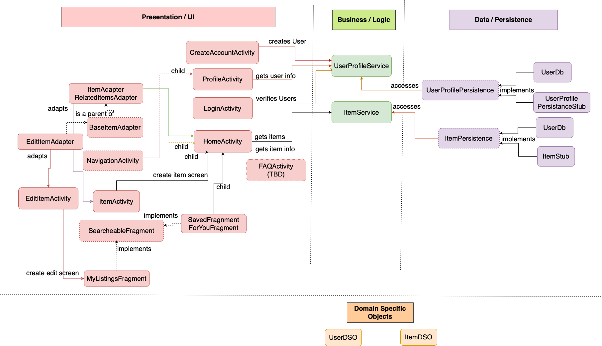

# Planned Architecture Model for Smile

The Smile application follows a structured three-tier architecture. What a user can see and interact with is the presentation Layer. It manages user interactions, rendering UI elements, and handling input from users. It communicates with the business layer to display relevant data for items or users and update the interface dynamically. Business/Logic Layer acts as the bridge between the UI and data storage. It processes user actions, enforces application rules, and manages core functionalities such as user authentication and item import. Data/Persistence Layer implements the UserProfilePersistence, and ItemPersistence interfaces to interact with stored data. It includes both a stub implementation to persist application data. Domain-specific objects are used for structured communication between layers.

### Tier 1: Presentation Layer

This layer is responsible for providing the user interface,which enables the user to interact with the application.

-   **CreateAccountActivity**: Displays the sign-up page that is used to create a new user, once the signUp button is clicked.

-   **HomeActivity**: Displays the homepage of the application, showcasing available items on the app.
-   **ForYouFragment**: Displays a list of all items that are available to the users from the database.

-   **SavedFragment**: Displays a list of all items that the user has saved as bookmarks.

-   **MyListingsFragment**: Displays a list of all items that the current user has listed for sale, allowing them to manage their own listings.

-   **SearchFragment**: This interface class displays a list of all items that the user has searched for.

-   **ProfileActivity**: Gets user information for facilitating user profile navigation.

-   **LoginActivity**: Gets user information for facilitating user profile navigation.

-   **ItemActivity**: Displays the details of a selected marketplace item, including its seller information and related items, allowing university members to browse and connect with sellers.

-   **BaseItemAdapter**: This abstract class is responsible for displaying the items in a RecyclerView for itemadapter and relateditemsadapter.

-   **ItemAdapter**: This class is responsible for displaying the items in a RecyclerView.

-   **RelatedItemsAdapter**: This class is responsible for displaying the related items in a RecyclerView.

-   **NavigationActivity**: This abstract class is responsible for handling the navigation between the different menu from the navigation bar.

-   **SellItemActivity**: This class is responsible for displaying the sell item page, allowing users to list items for sale by entering details such as name, description, category, condition, price, and payment modes.

-   **EditItemsActivity**: This class is responsible for displaying the edit item page, allowing users to edit their listed items and manage the items they have for sale.

-   **EditItemAdapter**: This class is responsible for displaying the items in a RecyclerView for edititemsactivity.

-   **FAQActivity**: This class is responsible for displaying the FAQ page. Currently, it is a placeholder for future implementation.

### Tier 2: Logic layer

This layer is responsible for creating users and handling retrieval and modification of items and User Objects.

-   **ItemService**: This class provides methods for retrieving marketplace items from the ItemPersistence class, including fetching items by category, retrieving a random selection of items, and fetching item details by ID.

-   **UserService**: This class handles user authentication and registration, providing methods for signing up new users( by adding them to the UserPersistence class) and verifying login credentials.

### Tier 3: Persistence layer

This layer is responsible for handling the storage of User and Item Objects in a database

-   **ItemPersistence**: ItemPersistence defines the methods for retrieval and storage of items.

-   **ItemPersistenceStub**: This is a stub of the ItemPersistence class that implements a hardcoded set of Items.

-   **ItemDb**: This class is responsible for handling the storage and management of Item Objects in a database.

-   **UserPersistence**: ItemPersistence defines the methods for the retrieval and storage of Users.

-   **UserPersistenceStub**: This is a stub of the ItemPersistence class that implements a hardcoded set of users.

-   **UserDb**: This class is responsible for handling the storage and management of User Objects in a database.

### Domain Specific Objects

-   **Item**: This represents a product listed on the app. It contains item details such as: name, description, category, condition, price, seller information, listing date, and payment modes.

-   **User**: This represents a User on the app. It contains user details such as first name,l ast anime, email, password, and phone number.
