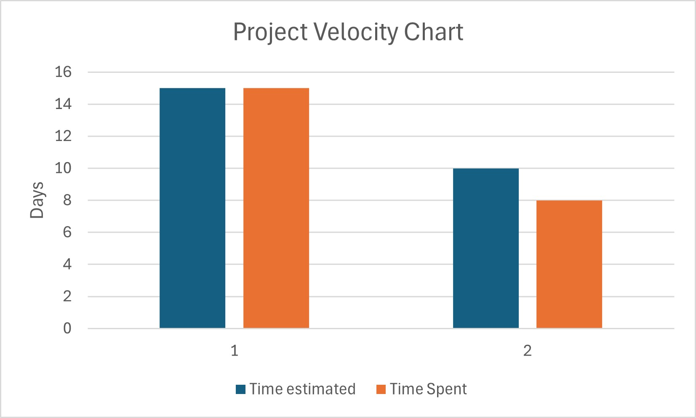

# ITERATION 3 PERSPECTIVE

## Unsuccessful Aspect of the Last Iteration (Iteration 2)
A part of the iteration that has not been as successful is the quality of the code written. While our team prioritized delivering features beyond the minimum requirements, this focus on quantity over quality led to significant technical debt for this iteration. In our last iteration (i.e., Iteration 2), only one person handled fixing technical debt, and we did not take into account every aspect of feedback. 

Additionally, we also realized that we had not been applying the majority of the coding principles we had learned during our classes, such as applying SOLID principles, implementing design patterns, and reducing excessive coupling in layers. Instead, our efforts were directed solely toward producing "bug-free" code without considering long-term maintainability or scalability. Our oversight resulted in a lower project score and highlighted the need for a more balanced approach.

## Key Lessons Learned:
1. **Technical Debt Management**: Neglecting refactoring early in the cycle created compounding issues (like the analogy of accumulating interest on a loan).
2. **Feedback Integration**: Skipping iteration code reviews led to missed opportunities for improvement.
3. **Team Allocation**: Overloading a single member with the responsibility of resolving the technical debt was inefficient.

## Goals for Iteration 3
To rectify these issues, Iteration 3 will prioritize code quality alongside feature delivery. Below are our concrete objectives:

### 1. Structured Refactoring:
- Dedicate 20% of sprint time to refactoring, focusing on:
  - Applying SOLID principles.
  - Improving code readability (e.g., meaningful variable names, comments).
- Complete all refactoring two days before the deadline to reserve time for testing.

### 2. Feature Completion Buffer:
- Finish at least one core feature four days early to accommodate unforeseen delays.

### 3. Code Freeze & Testing:
- Enforce a strict code freeze 48 hours before submission to prevent last-minute major bug fixes.

## Success Metrics:
- Achieve a minimum **40% reduction** in technical debt feedback from the grader for this iteration (e.g., we received 31 comments on this iteration, and we hope to reduce it to at least 18).
- Secure a **project score improvement of at least 15%** over Iteration 2.

## Project Velocity for Our Iterations:

### **Iteration 1:**  
**Features Completed:**
1. **Profile Management:**
   - Time estimated: 1 week  
   - Time completed: 1 week 1 day  
2. **Item Description:**
   - Time estimated: 1 week 1 day  
   - Time completed: 1 week  

**Total time estimated for Iteration 1 (in days):** 15 days  
**Total time spent for Iteration 1 (in days):** 15 days  

### **Iteration 2:**  
**Features Completed:**
1. **Look for Available Items:**
   - Time estimated: 1 week  
   - Time completed: 4 days  
2. **Categorize Items:**
   - Time estimated: 3 days  
   - Time completed: 4 days  

**Total time estimated for Iteration 2 (in days):** 10 days  
**Total time spent for Iteration 2 (in days):** 8 days  

It is important to note that we did not properly track our time completion for Iteration 1; therefore, the project velocity chart cannot be completely trusted to estimate our progress for this iteration. We also did not account for the time spent fixing technical debt, which can influence the effectiveness of the chart for future estimations.
# ITERATION 3 PERSPECTIVE

## Unsuccessful Aspect of the Last Iteration (Iteration 2)
A part of the iteration that has not been as successful is the quality of the code written. While our team prioritized delivering features beyond the minimum requirements, this focus on quantity over quality led to significant technical debt for this iteration. In our last iteration (i.e., Iteration 2), only one person handled fixing technical debt, and we did not take into account every aspect of feedback. 

Additionally, we also realized that we had not been applying the majority of the coding principles we had learned during our classes, such as applying SOLID principles, implementing design patterns, and reducing excessive coupling in layers. Instead, our efforts were directed solely toward producing "bug-free" code without considering long-term maintainability or scalability. Our oversight resulted in a lower project score and highlighted the need for a more balanced approach.

## Key Lessons Learned:
1. **Technical Debt Management**: Neglecting refactoring early in the cycle created compounding issues (like the analogy of accumulating interest on a loan).
2. **Feedback Integration**: Skipping iteration code reviews led to missed opportunities for improvement.
3. **Team Allocation**: Overloading a single member with the responsibility of resolving the technical debt was inefficient.

## Goals for Iteration 3
To rectify these issues, Iteration 3 will prioritize code quality alongside feature delivery. Below are our concrete objectives:

### 1. Structured Refactoring:
- Dedicate 20% of sprint time to refactoring, focusing on:
  - Applying SOLID principles.
  - Improving code readability (e.g., meaningful variable names, comments).
- Complete all refactoring two days before the deadline to reserve time for testing.

### 2. Feature Completion Buffer:
- Finish at least one core feature four days early to accommodate unforeseen delays.

### 3. Code Freeze & Testing:
- Enforce a strict code freeze 48 hours before submission to prevent last-minute major bug fixes.

## Success Metrics:
- Achieve a minimum **40% reduction** in technical debt feedback from the grader for this iteration (e.g., we received 31 comments on this iteration, and we hope to reduce it to at least 18).
- Secure a **project score improvement of at least 15%** over Iteration 2.

## Project Velocity for Our Iterations:

### **Iteration 1:**  
**Features Completed:**
1. **Profile Management:**
   - Time estimated: 1 week  
   - Time completed: 1 week 1 day  
2. **Item Description:**
   - Time estimated: 1 week 1 day  
   - Time completed: 1 week  

**Total time estimated for Iteration 1 (in days):** 15 days  
**Total time spent for Iteration 1 (in days):** 15 days  

### **Iteration 2:**  
**Features Completed:**
1. **Look for Available Items:**
   - Time estimated: 1 week  
   - Time completed: 4 days  
2. **Categorize Items:**
   - Time estimated: 3 days  
   - Time completed: 4 days  

**Total time estimated for Iteration 2 (in days):** 10 days  
**Total time spent for Iteration 2 (in days):** 8 days  

It is important to note that we did not properly track our time completion for Iteration 1; therefore, the project velocity chart cannot be completely trusted to estimate our progress for this iteration. We also did not account for the time spent fixing technical debt, which can influence the effectiveness of the chart for future estimations.

